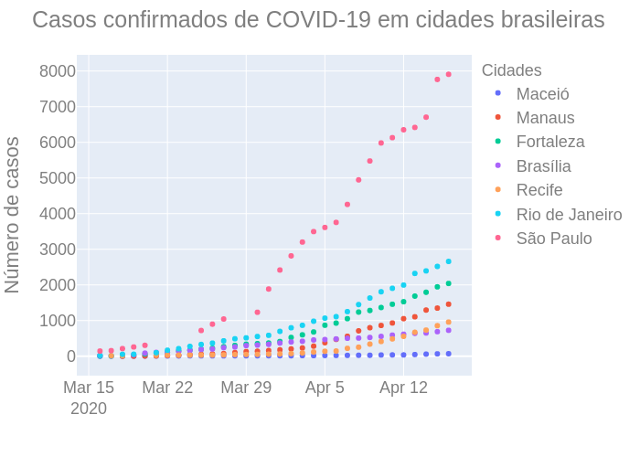
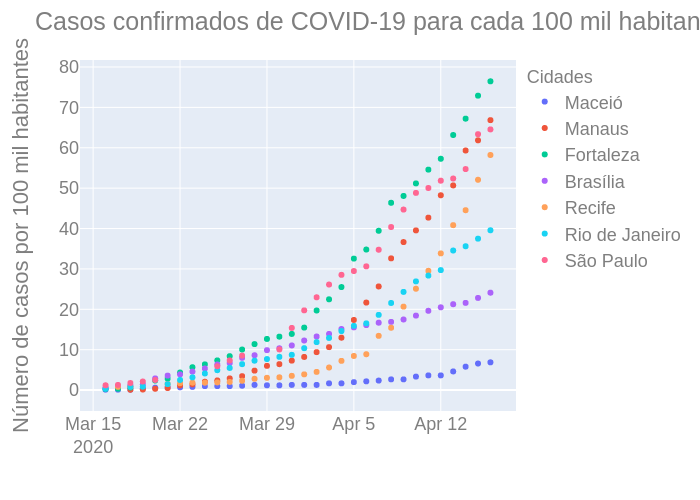

# COVID-19 no Brasil

### Por Priscila Santos

 Última atualização em 19 de abril às 21h 

A ideia deste relatório é acompanhar a evolução do número de casos e de mortes por COVID-19 no Brasil, por meio dos dados oficiais do Ministério da Saúde, das Secretarias de Saúde estaduais e municipais e de outras fontes oficiais. Os dados estão sendo obtidos por meio dos *sites* oficiais e de outros repositórios abertos listados a seguir. 

* [Brasil io](https://brasil.io/home/)
<!-- * Portal de Transparecência do Registro Civil -- https://transparencia.registrocivil.org.br/especial-covid -->

O país está com um grave problema de subnotificação de casos e óbitos, dada a dificuldade de importação, produção e processamento de testes. Assim, os gráficos a seguir mostram apenas parte do real cenário nacional cenário nacional, prejudicando as análises da situação nacional.

Os primeiros gráficos desta análise mostram a quantidade de casos confirmados e sua evolução em algumas cidades brasileiras. O primeiro gráfico (Fig. 01) mostra a evolução do número total de casos confirmados, desde o prmeiro caso registrado no Brasil, na cidade de São Paulo no dia 26/02. 

Os dados apresetados mostram que a capital paulistana é a cidade com maior número de casos confirmados em todo o país. Contudo, ela também é a cidade mais populosa, o que faz com que seja natural ela ter mais casos do que outros municípios. 

<!-- alguns sobre a evolução de casos confirmados e outros de mortes por COVID-19. A partir destes dados é possível perceber que até por volta do vigésimo dia após o início da epidemia, São Paulo era responsável por quase a totalidade de casos do país. Contudo, a partir do 24º dia de casos confirmados, o restante do Brasil passou a ter um aumento considerável de confirmações e os casos de São Paulo passaram a pesar menos no cenário nacional. Os dados indicam ainda, que tanto em São Paulo quanto nos outros Estados da Federação a quantidade de casos não parece estar chegando no ponto de máximo. --> 

<!--  -->
 
**Fig. 01**: Evolução dos casos confirmados de COVID-19 em algumas cidades brasileiras. 

Para tirar o feito do tamanho da população, é possível olharmos a quantidade proporcional de casos. A Figura 02, a seguir, apresenta a quantidade de cassos para cada 100 mil habitantes. Estes dados nos mostram que Fortaleza é a cidade acompanhada com uma situação mais preocupante. Nela, no dia 18 de abril, havia uma média de quase 80 casos para cada grupo de 100 mil habitantes, enquanto em São Paulo eram aproximadamente 65 casos confirmados para cada grupo de 100 mil pessoas. 

**Fig. 02**: Evolução da proporção de casos confirmados de COVID-19 por 100 mil habitantes, em algumas cidades brasileiras.

Tanto no gráfico geral de casos (Fig. 01) quanto no proporcional (Fig 02), Maceió é a cidade acompanhada que está com a melhor cituação. A quantidade de casos está baixa e não preocupa por enquanto. 
